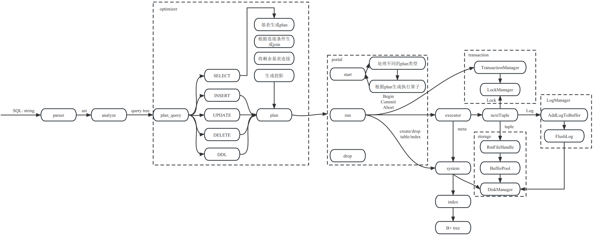
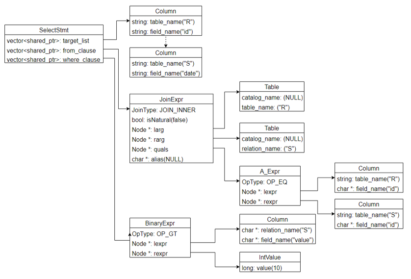

# RMDB项目结构

## 目录
- [环境配置](#环境配置)
- [编译与运行](#编译与运行)
- [单元测试](#单元测试)
- [代码框架](#代码框架)
- [存储管理 (Storage Management)](#存储管理storage-management)
- [索引 (Index)](#索引index)
- [并发控制 (Concurrency control)](#并发控制concurrency-control)
- [故障恢复 (Failure recovery)](#故障恢复failure-recovery)
- [查询处理与执行 (Query processing and execution)](#查询处理与执行query-processing-and-execution)
- [语法解析](#语法解析)
- [错误与异常处理](#错误与异常处理)

## 环境配置

RMDB 需要以下依赖环境库：

- `gcc 7.1` 及以上版本，要求完全支持 `C++17`
- `cmake 3.16` 及以上版本
- `flex`
- `bison`
- `readline`

在 Debian / Ubuntu 环境下，可以通过以下命令安装依赖：

```bash
sudo apt-get install build-essential
sudo apt-get install cmake
sudo apt-get install flex bison
sudo apt-get install libreadline-dev
```

可以通过 `cmake --version` 查看 CMake 版本。如果版本低于 `3.16`，需要从 CMake 官网下载 `3.16` 以上版本并手动安装。

CentOS 下编译时可能存在头文件冲突问题，不建议使用 Ubuntu 以外的操作系统。

## 编译与运行

RMDB 位于 `DB2024` 仓库中，整个系统分为服务端和客户端。

服务端编译命令如下：

```bash
mkdir build
cd build
cmake .. [-DCMAKE_BUILD_TYPE=Debug]|[-DCMAKE_BUILD_TYPE=Release]
make rmdb <-j4>|<-j8>
```

客户端编译命令如下：

```bash
cd rmdb_client
mkdir build
cd build
cmake .. [-DCMAKE_BUILD_TYPE=Debug]|[-DCMAKE_BUILD_TYPE=Release]
make rmdb_client <-j4>|<-j8>
```

服务端启动命令如下：

```bash
cd build
./bin/rmdb <database_name>
```

如果指定数据库已经存在，服务端会直接加载该数据库；如果不存在，系统会自动创建同名数据库。

客户端启动命令如下，用户可以同时开启多个客户端：

```bash
cd rmdb_client/build
./rmdb_client
```

客户端中可以使用 `exit` 命令关闭连接：

```sql
RMDB> exit;
```

服务端需要在服务端运行界面使用 `Ctrl+C` 关闭。关闭时，系统会把数据页刷新到磁盘中。

如果需要删除数据库，可以在 `build` 目录下删除与数据库同名的目录。如果需要删除某个数据库中的表文件，可以在 `build` 目录下进入对应数据库目录，然后删除表文件。

## 单元测试

单元测试使用 GoogleTest 框架。项目的 `src/` 目录下包含测试示例文件 `unit_test.cpp`，可以通过运行 `unit_test` 了解单元测试流程。

以 `unit_test` 为例，可通过以下命令进行测试：

```bash
cd build
make unit_test
./bin/unit_test
```

## 代码框架



（高清代码框架图见 `框架图.pdf`。）

系统包括查询解析、查询优化、查询执行、索引、事务、日志、存储等几个模块,当系统通过TCP连接接收到客户端发送的一条SQL语句时,首先通过parser进行解析,得到一个抽象语法树(AST),接着通过analyze解析器进行语义检查生成query tree(对应代码中的Query类),然后进入optimizer模块的plan_query()函数进行查询优化生成查询执行计划(对应代码中的Plan类),接着进入到portal模块进行查询执行,在portal模块中,首先通过start()函数进行相关资源的初始化,并把查询执行计划转换成算子树,根据算子树调用不同的算子以及system(元数据管理器)进行查询执行。在执行过程中,需要和事务管理器交互来进行事务资源的管理,和锁管理器交互对并发事务进行正确性控制,和存储模块进行交互进行数据的读写,以及和日志管理器交互添加日志。

## 存储管理(Storage Management)

### 相关知识点

- 数据库存储基本原理:数据库存储模型、存储介质和磁盘管理
- 文件存储组织:堆文件、顺序文件、B+树文件、Hash文件
- 元数据存储组织:数据字典;数据字典的组织与存储
- 记录存储组织:定长记录组织
- 缓冲区管理:缓冲区组织方式,缓冲区管理策略

### 项目结构

存储管理模块相关的子目录为src/record、src/replacer、src/storage和src/system,分别对应记录存储组织、缓冲区管理、文件存储管理和元数据存储组织。存储管理模块是底层模块,主要为上层模块提供接口。

在RMDB中,每一个数据库对应一个同名文件夹,该数据库中的所有数据都以文件的形式存储在该文件夹中。每一个数据库包含一个 <database>.meta 文件和 <database>.log 文件, <database>.meta 文件用来存储数据库的元数据,包括表的名称、表的元数据等信息; <database>.log 文件用来存储日志信息。

RMDB使用关系模型来进行存储,数据库中的表 <table> 包含了若干条记录 <record> ,这些记录都顺序存储在该表的同名文件中,并且以数据页(Page)的形式来对所有记录分页,进而通过对数据页的管理来统一管理表中的数据。

以下对各个子模块进行详细介绍:

#### 文件存储组织模块: src/storage

RMDB以数据页(Page)为单位对内存中的数据来进行统一管理。系统提供了Page类(Page class),通过BufferPoolManager来管理数据页在磁盘和内存中的I/O,通过DiskManager来进行磁盘中文件的读写。

#### Page

Page类是数据管理的基本单位,每一个Page都对应唯一的页号(PageId),每一个数据页都对应一个磁盘文件,对于同一个文件中的数据页,用page_no来对数据页进行索引。

```cpp
struct PageId {
int fd;   //   Page所在的磁盘文件开启后的文件描述符, 来定位打开的文件在内存中的位置
page_id_t page_no = INVALID_PAGE_ID;   // 该数据页位于所在文件的第几个数据页
};
```

每一个Page对象中存储了该数据页的相关信息以及该数据页存储的数据,可以分为页头(header)和数据区(data),页头存放有关页面内容的元数据;数据区是存放页面实际数据的区域,它可以用于存放表中的记录。由于页面既可以用于存储记录,也可以用于存储索引,所以页头和数据区这两部分的实际内容其实是由记录的组织结构或索引的组织结构决定的。为了区分这两者,对于记录页,定义为由记录头(record page header)和数据区组成,对于索引页,定义为由索引头(index page header)和数据区组成。目前本系统将页面大小(PAGE_SIZE)设计为固定的4KB大小,页面的数据结构如下:

```cpp
class Page {
public:
Page() { ResetMemory(); }

private:
void ResetMemory() { memset(data_, OFFSET_PAGE_START, PAGE_SIZE); }   // 将data_的
PAGE_SIZE个字节填充为0

PageId id_;     /** page的唯一标识符 */

char data_[PAGE_SIZE] = {};     // 该数据页存储的数据

bool is_dirty_ = false;         // 该数据页是否为脏页,如果是脏页,系统需要根据缓冲池管理策略
在合适的时间将页面数据写入磁盘

int pin_count_ = 0;             // 用于记录正在使用该页面的线程个数

ReaderWriterLatch rwlatch_;     // 该数据页的latch,用来保证数据页的并发操作正确性。
/*
ReaderWriterLatch分为读锁和写锁,每个线程在读写页面之前需要申请对应的锁,操作完成后释放对应的锁。
如果在一个线程中获取了页面的写锁,那么其他线程无法读取和写入该页面,直到其释放写锁;如果在一个线程中获取
了页面的读锁,那么其他线程无法写入该页面(可以读取),直到其释放读锁。
*/

};
```

在这些数据结构中,只有data是在内存和磁盘中进行交换,其内容就是之前提到的页头和数据区。

其他的数据结构只在内存中使用,并不会写入磁盘。

#### DiskManager

DiskManager负责磁盘文件的操作,为上层模块提供了操作文件、读写页面的功能。其数据结构如下:

```cpp
class DiskManager {
private:
std::unordered_map<std::string, int> path2fd_;   // <Page文件磁盘路径,Page fd>哈希表
std::unordered_map<int, std::string> fd2path_;   // <Page fd,Page文件磁盘路径>哈希表
int log_fd_ = -1;                                // 日志文件的句柄
std::atomic<page_id_t> fd2pageno_[MAX_FD]{};     // 在文件fd中分配的page no个数
};
```

#### BufferPoolManager

BufferPoolManager对内存中的缓冲池进行管理,内存中的缓冲池由若干个帧(frame)组成,缓冲池中每一个帧可以存放一个数据页,没有存放数据页的帧叫做空闲帧。系统对缓冲池中所有数据页的修改都暂时保存在内存中,只有当缓冲池中的数据页被替换时,才会把这些修改的数据刷新到磁盘中。缓冲池数据结构如下:

```cpp
class BufferPoolManager {
private:
size_t pool_size_;   // 缓冲池中帧的数目,也就是最多能够同时容纳的数据页的个数

Page *pages_;        // 连续存放的页面数组,在构造函数中进行初始空间申请

std::unordered_map<PageId, frame_id_t, PageIdHash> page_table_; // 页表,记录数据页和帧
的映射关系,如果数据页存放在某一帧中,则在页表中存放该数据页ID和对应帧号的映射关系,用于标记数据页在缓冲
池中的存放位置

std::list<frame_id_t> free_list_; // 缓冲池中未使用的空闲帧的帧号列表

LRUReplacer *replacer_; // 用于提供缓冲池的页面替换算法。当空闲帧列表为空时,表示所有的帧都被页
面占用了,这时如果要把一个新的数据页放入缓冲池中,就必须淘汰一个旧页面,使用替换算法器可以选择一个能被淘
汰的页面。

std::mutex latch_;   // 用于缓冲池的并发控制
};
```

缓冲区管理:src/replacer

缓冲区管理模块主要提供了缓冲池页面的管理策略,目前本系统使用LRU(Least Recently Used)管理策略,即最近最少使用页面置换算法,当缓冲池需要淘汰一个页面时,选择最近最久未使用的页面进行淘汰,提供以下数据结构:

```cpp
class LRUReplacer {
private:
std::mutex latch_;                // 互斥锁,用于并发控制

std::list<frame_id_t> LRUlist_;   // 维护不被固定的帧列表,不被固定的帧存放的页面是可以被淘汰
的,该列表按照帧被取消固定的时间戳顺序存放

std::unordered_map<frame_id_t, std::list<frame_id_t>::iterator> LRUhash_;   // 维护帧
号和LRUlist_中对象的映射关系

size_t max_size_;    // 最大容量(与缓冲池的容量相同)
};
```

记录存储组织模块:src/record

记录存储组织模块为上层模块提供了对表中记录的操作接口,包括记录文件的创建和删除、记录的插入修改和删除、记录文件中数据页的读写等。

首先介绍记录文件相关的数据结构,每一个数据库中的表可以分为表的元数据和表的记录数据,表的元数据统一存储在 <database.meta> 文件中,表的记录数据单独存储在同名文件中,我们称该文件为记录文件,在RMDB中,我们用RmFileHandle类来对一个记录文件进行管理,RmFileHandle类中记录了文件描述符和文件头信息,数据结构如下:

```cpp
class RmFileHandle {
private:
int fd_;         // 文件描述符,操作系统打开磁盘文件后的一个编号,用于唯一地标识打开的文件

RmFileHdr file_hdr_;   // 文件头信息
};
```

文件头信息用RmFileHdr结构体来进行维护。前文中提到,记录文件中顺序存放该表的每一条记录,按照数据页的形式进行划分,在目前系统中,同一个表中的所有记录大小是相同的,因此,在一个表创建之初,该表的record_size就固定下来了;对于数据页的管理,本系统目前使用Bitmap的形式进行管理,因此,在RmFileHdr中还记录了bitmap的大小,对于每一个数据页,都使用一个Bitmap来对该数据页的记录进行管理,因此Bitmap的大小在表创建之初就可以计算出来。RmFileHdr的数据结构如下:

```cpp
struct RmFileHdr {
int record_size;     // 元组大小(长度不固定,由上层进行初始化)
int num_pages;              // 文件中当前分配的page个数(初始化为1)
int num_records_per_page;   // 每个page最多能存储的元组个数
int first_free_page_no;     // 文件中当前第一个可用的page no(初始化为-1)
int bitmap_size;            // bitmap大小
};
```

file_hdr中的num_pages记录此文件分配的page个数,page_no范围为[0,file_hdr.num_pages),page_no从0开始增加,其中第0页存file_hdr,从第1页开始存放真正的记录数据。

对于每一个数据页,本系统使用RmPageHandle类进行封装管理,每一个数据页的开始部分并不直接存放记录数据,而是按照以下顺序进行存放:

| page_lsn_ | page_hdr | bitmap | slots |

- page_lsn_用于故障恢复模块,将在故障恢复模块中进行详细介绍。
- page_hdr记录了两个信息,一个是num_records,记录当前数据页中已经分配的record个数,同时记录了
- next_free_page_no,记录了如果当前数据页写满之后,下一个还有空闲空间的数据页的page_no。
- bitmap记录了当前数据页记录的分配情况。
- slots则是真正的记录数据存放空间。
RmPageHandle的数据结构如下:

```cpp
struct RmPageHandle {
const RmFileHdr *file_hdr;      // 用到了file_hdr的bitmap_size, record_size
Page *page;                     // 指向单个page
RmPageHdr *page_hdr;            // page->data的第一部分,指针指向首地址,长度为
sizeof(RmPageHdr)
char *bitmap;                   // page->data的第二部分,指针指向首地址,长度为file_hdr-
>bitmap_size
char *slots;                    // page->data的第三部分,指针指向首地址,每个slot的长度为
file_hdr->record_size
};
```

对于具体的每一个记录,使用RmRecord来进行管理,数据结构如下:

```cpp
struct RmRecord {
char *data;     // data初始化分配size个字节的空间
int size;       // size = RmFileHdr的record_size
};
```

同时,使用Rid来对每一个记录进行唯一的标识,数据结构如下:

```cpp
struct Rid {
int page_no;    // 该记录所在的数据页的page_no
int slot_no;    // 该记录所在数据页中的具体slot_no
};
```

元数据存储组织:src/system

system模块主要负责元数据管理和DDL语句操作执行,在存储模块主要涉及到了元数据管理,因此只对元数据存储相关的数据结构进行介绍,其余功能在查询模块进行介绍。

元数据存储相关的数据结构主要在sm_meta.h文件中,首先,对于一个数据库,使用DbMeta类来进行数据库元数据管理,数据结构如下:

```cpp
class DbMeta {
std::string name_;
std::map<std::string, TabMeta> tabs_;
};
```

主要包含数据库的名称,以及数据库终所有表的元数据,这些数据每执行一次DDL语句都要被写入到 <database.meta> 文件中,并且在open_db()时读取到内存中。

表的元数据主要通过TabMeta数据结构来进行管理:

```cpp
struct TabMeta {
std::string name;                   // 表名称
std::vector<ColMeta> cols;          // 表包含的字段
std::vector<IndexMeta> indexes;     // 表上建立的索引
};
```

对于每一个字段,通过ColMeta数据结构来进行管理:

```cpp
struct ColMeta {
std::string tab_name; // 表名称
std::string name;       // 字段名称
ColType type;           // 字段类型
int len;                // 字段长度
int offset;             // 字段所在记录中的偏移量,用于查询字段的具体存储位置
};
```

对于索引结构,通过IndexMeta数据结构来进行管理:

```cpp
struct IndexMeta {
std::string tab_name;             // 索引所属表名称
int col_tot_len;                  // 索引字段长度总和
int col_num;                      // 索引字段数量
std::vector<ColMeta> cols;        // 索引包含的字段
};
```

## 索引(Index)

### 相关知识点

- 顺序索引:稠密索引及其查找算法,稀疏索引及其查找算法,多级索引及其查找算法,辅助索引
- B+树索引:B+树索引结构,索引查找,索引维护
- 哈希索引:基本Hash索引,可扩展Hash索引,线性Hash索引
- Bitmap索引:Bitmap索引结构,Bitmap索引查找,编码Bitmap索引
### 项目结构

索引模块相关的子目录为 `src/index`，主要实现了 `B+` 树，用来支持索引功能。

在本系统中,B+树以文件的方式存储在磁盘中,B+树的每个节点存储在一个磁盘文件的页面中,每个结点存储若干个键值对,在本系统中,如果想要把一个元组插入B+树,那么该元组会被解析成一个键值对 <key, value> ,其中key存储该元组中索引所在列的数据,value代表该元组的rid。

我们使用 IxFileHdr 来管理B+树文件的元数据,其中num_pages_用来记录文件中的页面数量,root_page_用来存储B+树根节点对应的页号,first_free_page_no_代表文件中第一个空闲的磁盘页面的页面号,col_num_记录索引包含的字段数量,col_types_和col_lens_分别记录字段的数据类型和数据长度,col_tot_len_存储索引包含的字段的总长度,btree_order_存储一个B+树节点所能存储的最多的键值对数量。在每个节点对应的页面中,页面首部存储页面的元信息,然后存储所有的key,页面的末尾部分用来存储所有的value,因此,需要用keys_size用来记录当前节点中所有key数据的大小,以便确定value部分的首地址。first_leaf和last_leaf分别存储首叶节点对应的页号和尾叶节点对应的页号。

```cpp
class IxFileHdr {
page_id_t first_free_page_no_;     // 文件中第一个空闲的磁盘页面的页面号
int num_pages_;                    // 磁盘文件中页面的数量
page_id_t root_page_;              // B+树根节点对应的页面号
int col_num_;                      // 索引包含的字段数量
std::vector<ColType> col_types_;   // 字段的类型
std::vector<int> col_lens_;        // 字段的长度
int col_tot_len_;                  // 索引包含的字段的总长度
int btree_order_;                  // # children per page 每个结点最多可插入的键值对数
量
int keys_size_;                    // keys_size = (btree_order + 1) * col_tot_len
// first_leaf初始化之后没有进行修改,只不过是在测试文件中遍历叶子结点的时候用了
page_id_t first_leaf_;             // 首叶节点对应的页号,在上层IxManager的open函数进行初
始化,初始化为root page_no
page_id_t last_leaf_;              // 尾叶节点对应的页号
int tot_len_;                      // 记录结构体的整体长度
};
```

系统使用 IxPageHdr 来管理每个磁盘块(在内存中叫页面)的元数据,其中parent记录父结点所在页面的页号,num_key代表当前节点中已经插入的键值对的数量,is_leaf用来判断当前节点是否为叶子节点,如果当前结点是叶子结点,那么prev_leaf存储当前结点的前一个叶子节点,next_leaf记录当前结点的下一个叶子结点。

```cpp
class IxPageHdr {
page_id_t next_free_page_no;       // unused
page_id_t parent;                  // 父亲节点所在页面的叶号
int num_key;                       // # current keys (always equals to #child - 1) 已插
入的keys数量,key_idx∈[0,num_key)
bool is_leaf;                      // 是否为叶节点
page_id_t prev_leaf;               // previous leaf node's page_no, effective only
when is_leaf is true
page_id_t next_leaf;               // next leaf node's page_no, effective only when
is_leaf is true
};
```

系统在其他模块如存储模块、执行模块中,使用 Rid 来存储记录号,在索引模块中使用 Iid 来存储记录号,二者是等价的,一一对应的。

系统中, IxNodeHandle 和 IxIndexHandle 分别提供了对B+树节点的操作方法和对B+树的操作方法。 IxManager 类为上层模块提供了创建索引、删除索引、把索引文件读取到内存中、关闭索引文件等接口。 IxScan 类提供了遍历B+树叶子节点的功能。

## 并发控制(Concurrency control)

### 相关知识点

- 两阶段封锁协议:协议内容;两阶段封锁协议存在的问题;死锁与级联回滚;死锁预防策略;严格两阶段封锁
- 协议
### 项目结构

并发控制模块相关代码子目录为 `src/transaction`，主要包含事务管理器与锁管理器，提供事务管理方法和并发控制算法。其中 `src/transaction/concurrency` 文件夹中提供事务的并发控制算法。

本系统通过Transaction对象来维护事务上下文信息,数据结构如下:

```cpp
class Transaction{
private:
bool txn_mode_;                      // 用于标识当前事务为显式事务还是单条SQL语句的隐式事务
TransactionState state_;             // 事务状态
IsolationLevel isolation_level_;     // 事务的隔离级别,默认隔离级别为可串行化
std::thread::id thread_id_;          // 当前事务对应的线程id
lsn_t prev_lsn_;                     // 当前事务执行的最后一条操作对应的lsn,用于系统故障恢复
txn_id_t txn_id_;                    // 事务的ID,唯一标识符
timestamp_t start_ts_;               // 事务的开始时间戳

std::shared_ptr<std::deque<WriteRecord *>> write_set_;    // 事务包含的所有写操作
std::shared_ptr<std::unordered_set<LockDataId>> lock_set_;    // 事务申请的所有锁
std::shared_ptr<std::deque<Page*>> index_latch_page_set_;            // 维护事务执行过程
中加锁的索引页面

std::shared_ptr<std::deque<Page*>> index_deleted_page_set_;   // 维护事务执行过程中删
除的索引页面
};
```

事务管理器TransactionManager类提供了事务的开始、提交和终止方法,并维护全局事务表txn_map,记录事务ID和事务对象指针的映射。数据结构如下:

```cpp
class TransactionManager{
private:
ConcurrencyMode concurrency_mode_;       // 事务使用的并发控制算法,目前只需要考虑2PL
std::atomic<txn_id_t> next_txn_id_{0};   // 用于分发事务ID
std::atomic<timestamp_t> next_timestamp_{0};    // 用于分发事务时间戳
std::mutex latch_;   // 用于txn_map的并发
SmManager *sm_manager_;
LockManager *lock_manager_;
public:
static std::unordered_map<txn_id_t, Transaction *> txn_map; // 全局事务表
};
```

锁管理器LockManager提供了行级锁、表级锁和表级意向锁,使用LockDataId来对加锁对象进行唯一标识:

```cpp
class LockDataId {
public:
int fd_;             // 数据项所在表对应的文件句柄
Rid rid_;            // 如果加锁对象是元组,rid_记录该元组的Rid
LockDataType type_; // 记录加锁对象是元组还是表
};
```

同时,锁管理器提供了加锁和解锁方法,维护了全局锁表,使用LockRequest类来代表一个锁,用LockRequest类来维护加在数据项上的锁队列,用一个全局映射lock_table_来维护全局的锁表:

```cpp
class LockManager {
private:
std::mutex latch_;   // 用于保证LockManager并发操作的正确性
std::unordered_map<LockDataId, LockRequestQueue> lock_table_; // 全局锁表
};
```

## 故障恢复(Failure recovery)

### 相关知识点

- 基于REDO/UNDO日志的恢复算法:基于REDO/UNDO日志的恢复算法;算法的优缺点分析
- 恢复算法ARIES:LSN;日志结构;日志缓冲区管理;ARIES算法
### 项目结构

故障恢复模块相关代码子目录为 `src/recovery`，主要包含日志管理器和故障恢复管理器。

日志记录使用LogRecord对象来进行存储,LogRecord分为日志头和日志数据项,日志头记录每一条日志都需要记录的固定信息,包括以下内容:

```cpp
class LogRecord {
LogType log_type_;           /* 日志对应操作的类型 */
lsn_t lsn_;                  /* 当前日志的lsn */
uint32_t log_tot_len_;       /* 整个日志记录的长度 */
txn_id_t log_tid_;           /* 创建当前日志的事务ID */
lsn_t prev_lsn_;             /* 事务创建的前一条日志记录的lsn,用于undo */
};
```

根据日志记录对应操作的类型,需要记录不同的数据项信息,框架中给出了Begin操作和Insert操作对应的数据结构,以插入操作为例,对应数据结构如下:

```cpp
class InsertLogRecord: public LogRecord {
RmRecord insert_value_;       // 插入的记录
Rid rid_;                     // 记录插入的位置
char* table_name_;            // 插入记录的表名称
size_t table_name_size_;      // 表名称的大小
};
```

参赛队伍需要实现其他操作对应的数据结构。

日志管理器主要提供添加日志和把日志刷入磁盘的功能,提供了日志缓冲区用来存放WAL日志记录:

```cpp
/* 日志缓冲区,只有一个buffer,因此需要阻塞地去把日志写入缓冲区中 */
class LogBuffer {
public:
LogBuffer() {
offset_ = 0;
memset(buffer_, 0, sizeof(buffer_));
}

bool is_full(int append_size) {
if(offset_ + append_size > LOG_BUFFER_SIZE)
return true;
return false;
}

char buffer_[LOG_BUFFER_SIZE+1];
int offset_;        // 写入log的offset
};
```

其他模块通过日志管理器的add_log_to_buffer()接口来把日志记录写入缓冲区,通过flush_log_to_disk()接口来把日志记录刷盘,日志管理器数据结构如下:

```cpp
class LogManager {
std::atomic<lsn_t> global_lsn_{0};   // 全局lsn,递增,用于为每条记录分发lsn
std::mutex latch_;                   // 用于对log_buffer_的互斥访问
LogBuffer log_buffer_;               // 日志缓冲区
lsn_t persist_lsn_;                  // 记录已经持久化到磁盘中的最后一条日志的日志号
DiskManager* disk_manager_;
};
```

系统中使用两个lsn来保证WAL的正确性,一个是日志管理器维护的persisten_lsn_,一个是每个数据页维护的page_lsn_,persistent_lsn_字段用来标识已经刷新到磁盘中的最后一条日志的日志序列号,page_lsn_记录了最近一个对该数据页进行写操作的操作对应的日志序列号,当存储层想要把内存中的数据页刷新到磁盘中时,首先要保证page_lsn_小于等于当前系统的持久化日志序列号persisten_lsn_,保证对该数据页进行修改的所有操作对应的日志记录已经刷新到了磁盘中。

故障恢复管理器主要提供故障恢复功能,分为analyze()、redo()和undo()三个接口,需要自主完成。

## 查询处理与执行(Query processing and execution)

### 相关知识点

- 查询解析:词法分析,语法分析,语法树
- 基本算子实现:扫描操作算法:全表扫描,索引扫描;连接操作算法:嵌套循环连接,Hash连接,索引连接
- 查询优化实现技术:查询优化的搜索空间,搜索优化计划的方法(穷举法、启发式方法、动态规划等)
- 查询执行框架:火山执行模型;物化执行模型;向量执行模型(SIMD)

### 项目结构

查询处理与执行模块相关的子目录为 `src/analyze`、`src/optimizer`、`src/execution`、`src/system`。

本系统的查询引擎采用迭代器模型,每个数据库操作对应一个算子(executor),每个算子提供一个核心接口Next(),执行一次算子便可通过Next接口获得一个元组。系统提供了insert操作对应的算子,参赛队伍需要自主实现update、delete对应的算子,以及扫描算子、连接算子等。

当SQL语句经过语法解析模块的处理,获得抽象语法树之后,进入分析器analyze,在分析器中需要进行语义分析,包括表是否存在、字段是否存在等,并把AST改写成Query,然后进入optimizer阶段,optimizer负责进行查询优化并生成查询执行计划,生成查询执行计划后,进入portal模块,portal模块分为start、run和drop三个阶段,start阶段负责相关资源初始化,并把查询执行计划转换成对应的算子树,run阶段通过各个算子的Next()接口进行sql语句的执行,drop阶段需要释放start阶段申请的资源。

对于DDL语句和事务语句,在进入到portal模块的run阶段后,会和SmManager以及TransactionManager进行交互,进行DDL语句及事务语句的执行。

本系统中,DbMeta维护了数据库相关元数据,包括数据库的名称和数据库中创建的表,数据结构如下:

```cpp
class DbMeta {
private:
std::string name_;      // 数据库名称
std::map<std::string, TabMeta> tabs_;    // 数据库内的表名称和元数据的映射
};
```

表的元数据和字段的元数据分别用TabMeta和ColMeta来维护:

```cpp
struct TabMeta {
std::string name;    // 表的名称
std::vector<ColMeta> cols;     // 表的字段
};
```

```cpp
struct ColMeta {
std::string tab_name;    // 字段所属表名称
std::string name;        // 字段名称
ColType type;            // 字段类型
int len;                 // 字段长度
int offset;              // 字段位于记录中的偏移量
bool index;              // 该字段上是否建立索引
};
```

ColMeta中字段的类型包括int类型( TYPE_INT )、float类型( TYPE_FLOAT )和string类型( TYPE_STRING )。

## 语法解析

语法解析模块相关代码位于 `src/parser` 文件夹中。

`src/parser` 中的 `lex.l` 和 `yacc.y` 分别对应词法分析和语法分析规则。开发者修改这两个文件之后，需要重新生成对应的 C++ 文件：

```bash
flex --header-file=lex.yy.hpp -o lex.yy.cpp lex.l
bison --defines=yacc.tab.hpp -o yacc.tab.cpp yacc.y
```

### 语法树结构



本系统的语法树中,不同类型的节点对应不同的结构体,所有节点都继承父类TreeNode,所有的语法树节点都定义在ast.h文件中,以下面的select语句为例,通过对该语句语法树的描述,来举例说明本系统语法树结构:

```sql
SELECT R.id , S.date
FROM R JOIN S
ON R.id = S.id
WHERE S.value>100;
```

select语句对应的语法树结构:

可以看到,该语法树的根节点指出整个语句为Select类型,其子节点包括了被选投影列节点列表,from从句和where从句列表。在from从句子树中,根节点为Join运算,子节点包括了需要连接的两个表R和表S以及连接条件表达式节点A_Expr,A_Expr节点和其叶子节点一起构成了连接运算条件R.id=S.id。而where从句节点同样也构成了一个表达式子树,通过叶子节点的数据和表达式的OpType:Greater构成了选择条件S.value>100。

## 错误与异常处理

本系统内所有的异常都位于 `error.h` 文件中，都具有共同的父类 `RMDBError`，所有异常都需要传入一个 `string` 参数来描述系统的异常信息。
